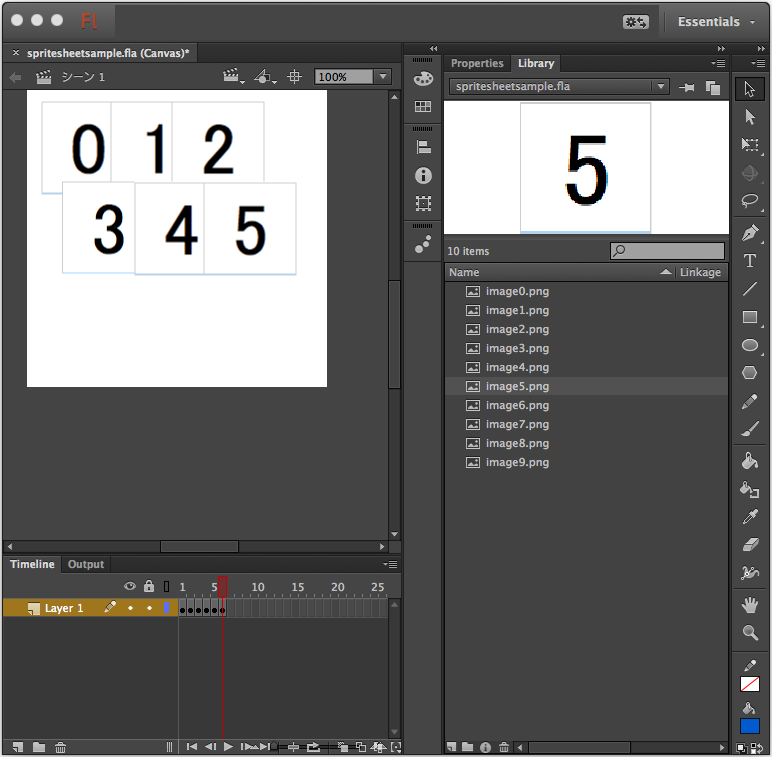
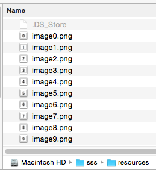
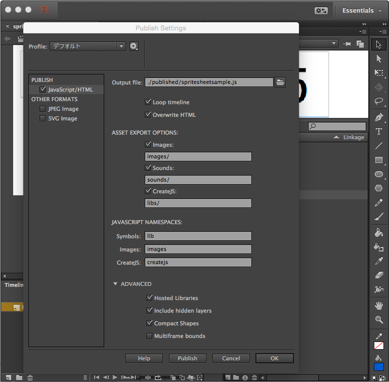
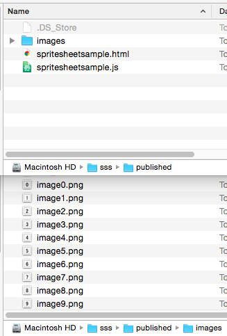
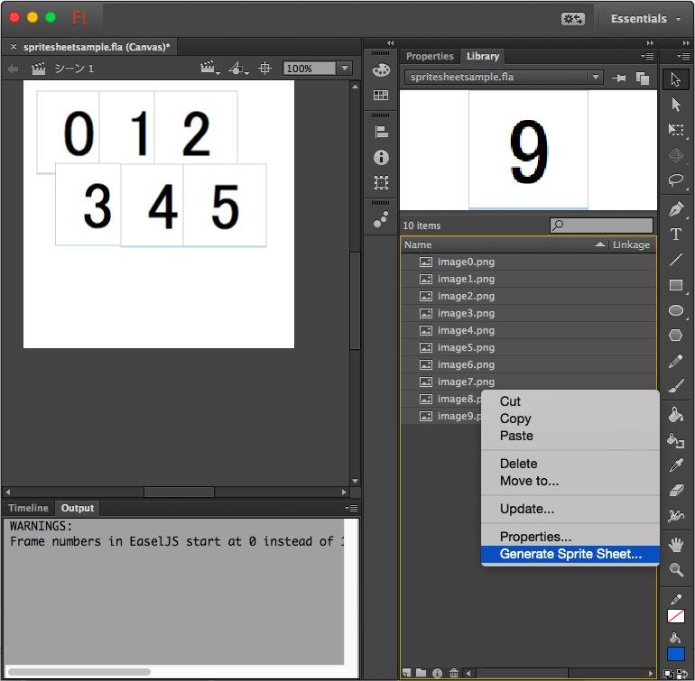
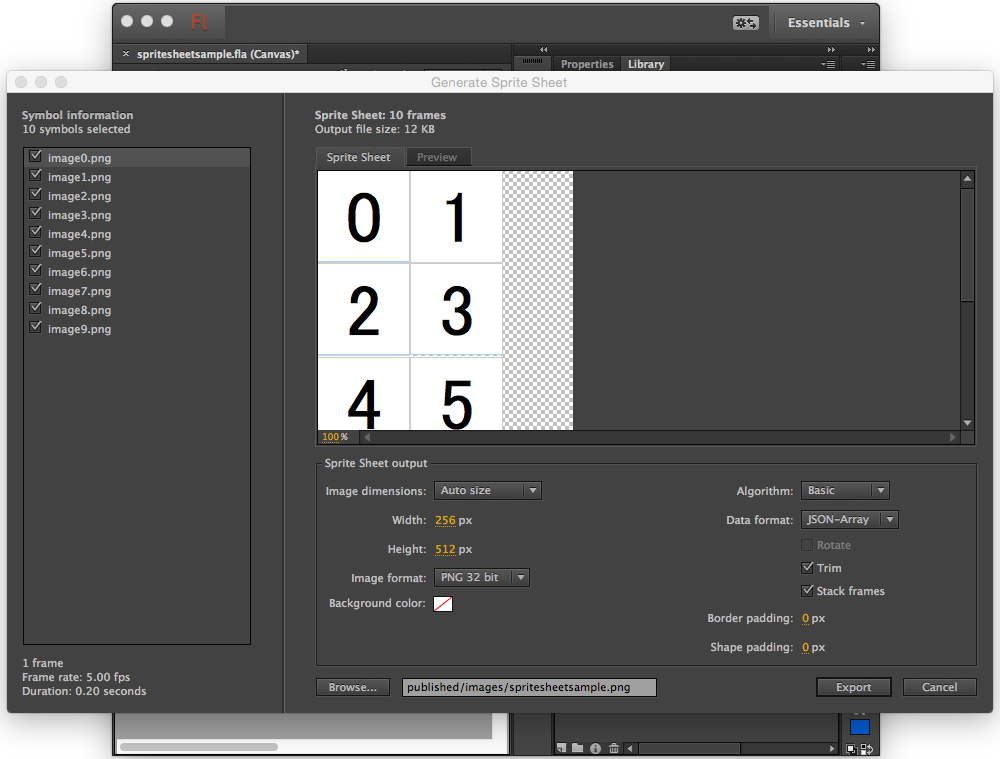
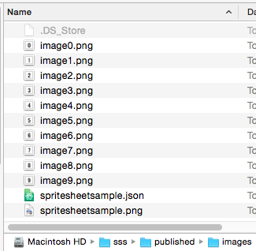
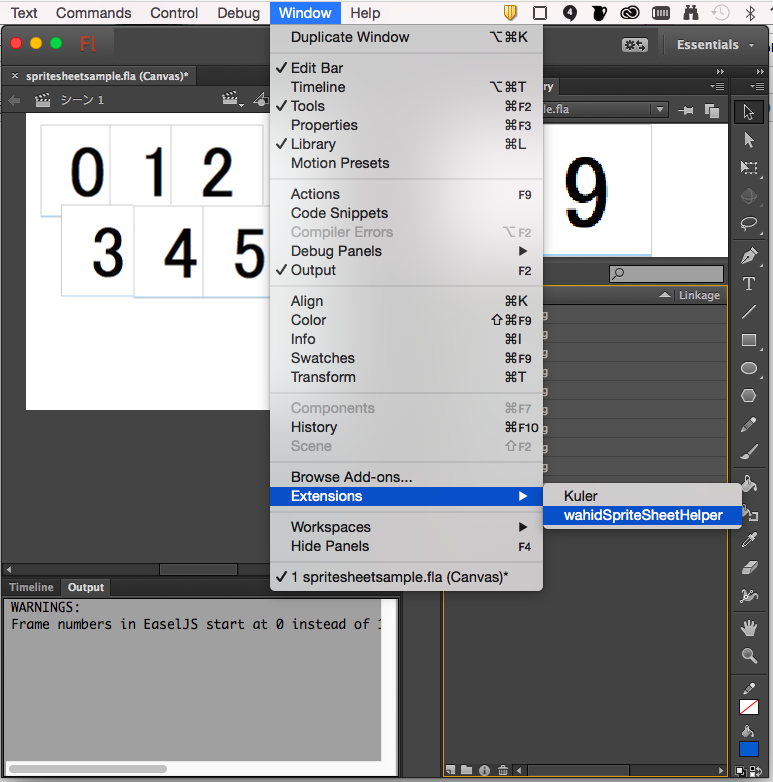
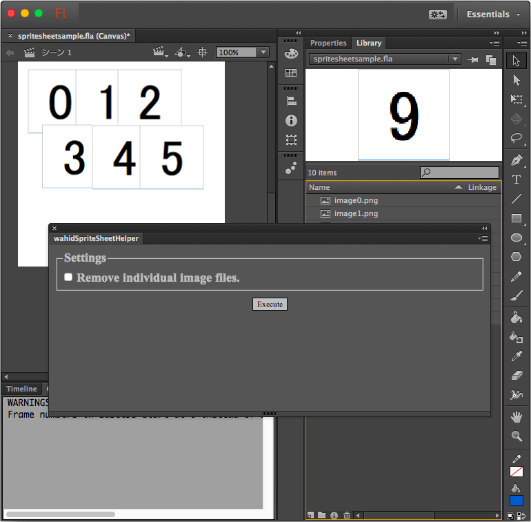
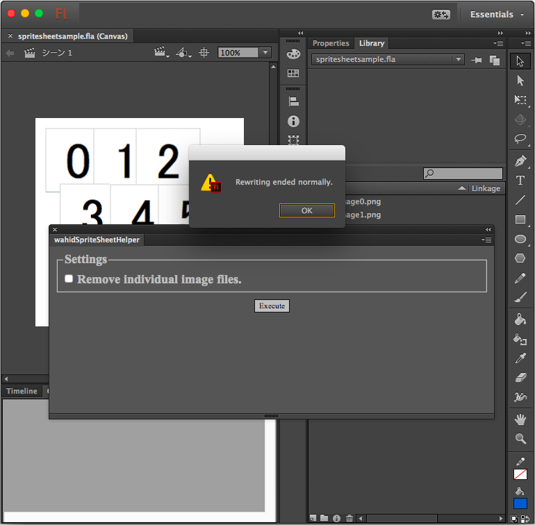

# How to use (Step by step guide)
To use this extension, install Adobe Extension Manager CC.  Double click the this extension's zxp file (download from [here](./exported/wahidSpriteSheetHelper.zxp) or [build it yourself](./README.md#how-to-build-the-extension)) and confirm that it was installed successfully on the Extension Manager CC.

This extension embeds sprite sheet data generated with the Flash sprite sheet generater into the Javascript file published from the Flash.  It changes image files loaded by the Javascript to sprite sheet image files and sets the sourceRect property in the image Wahid Object.  You can also remove unnecessary image files that combined into the sprite sheet image.

First, create a Flash document and embed individual image files in it.

Publish the Flash document as HTML5 format.  Check to be sure that the "Output file" includes not only the file name but also the path to the file. If it is the default value, the extension may not be able to acquire the output file path.
  
  

Generate a sprite sheet from individual image files.  Choose "JSON-ARRAY" as the data format.  Select the 
published image directory for the output destination.
  
  
  

Save the Flash document, open the "wahidSpriteSheetHelper" extension.
  
  

Check the "Remove individual image files." checkbox if you want and click the "Execute" button.  The process is completed when the dialog "Rewriting ended normaly." appears.  Open the published HTML file and check that it works fine.
  

That's all.

# Note
If there are blank characters in path strings, the extension may not work normally.

Image file name limitation.
 * Only alphanumeric characters and '_'(underscore) can be used for it.
 * File name must begin with an alphabet charater.
 * Do not use files with same base name but different suffixes only (for example:image.jpg and image.png)
 
In addition, the extension cannot handle some file names. For example, the following file names will occurs an error, but are not limited to.
* constructor
* toString
* hasOwnedProperty
* isPrototypeOf

(end)
