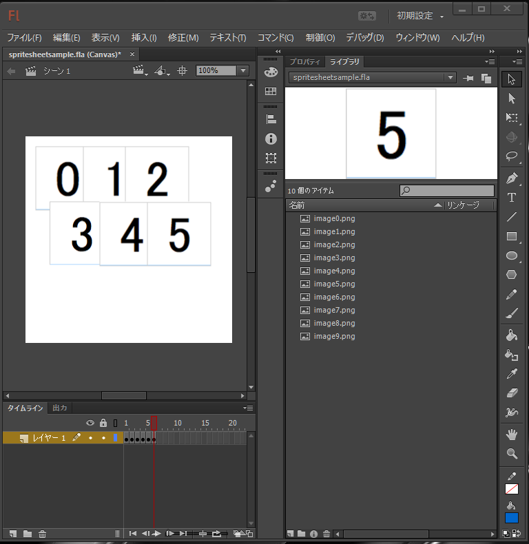
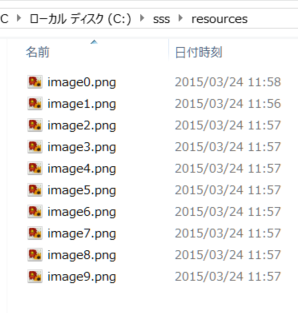
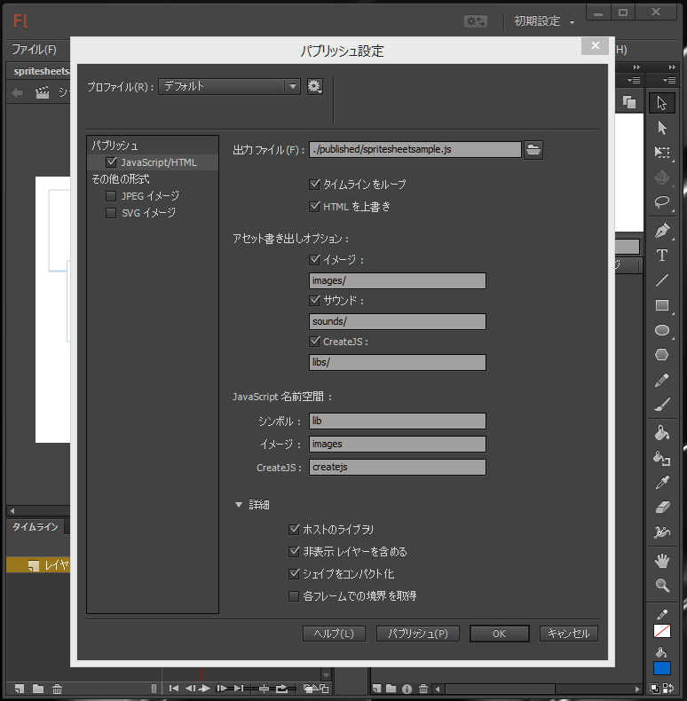
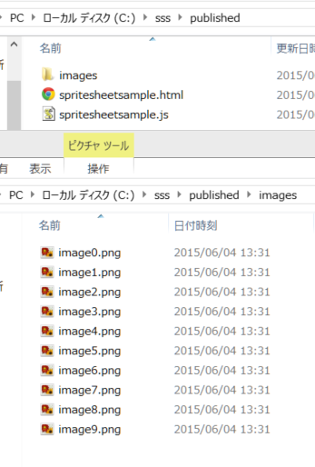
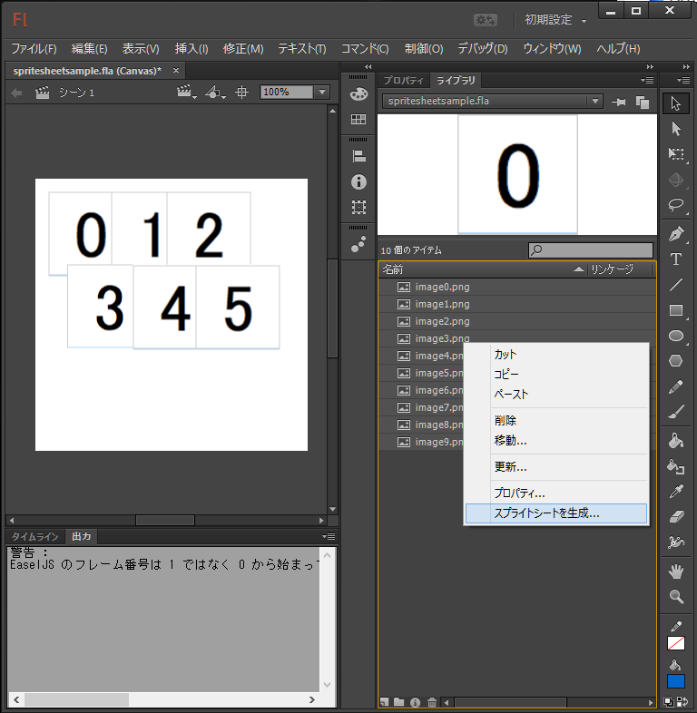
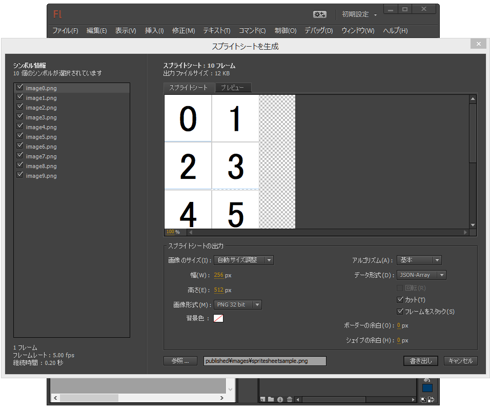
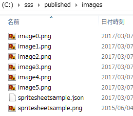
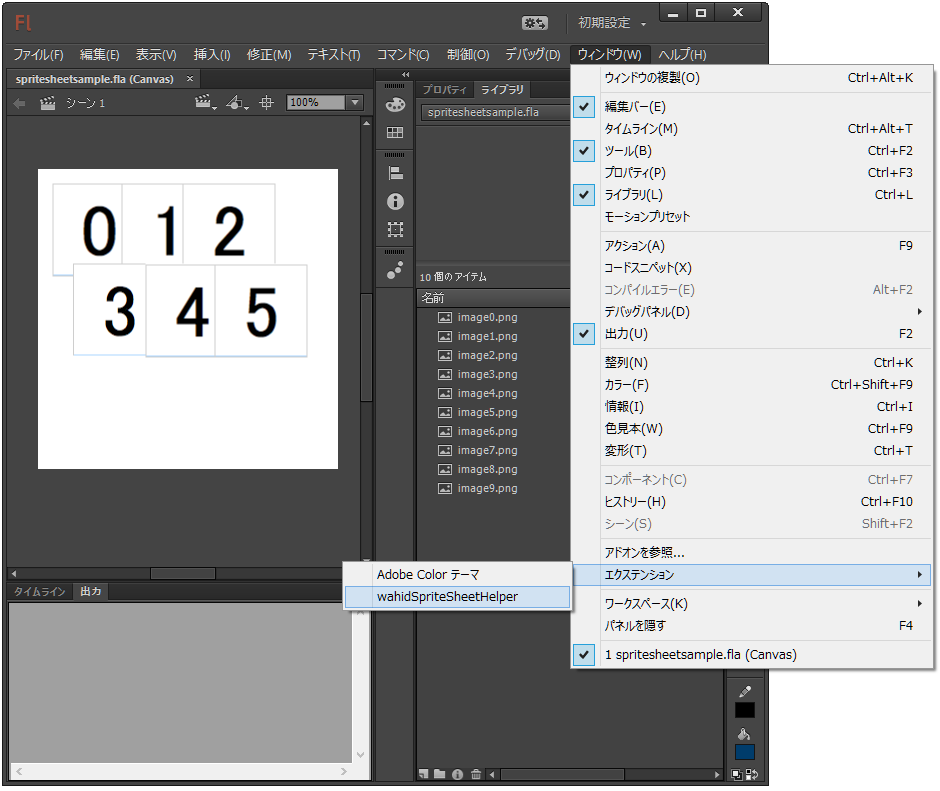
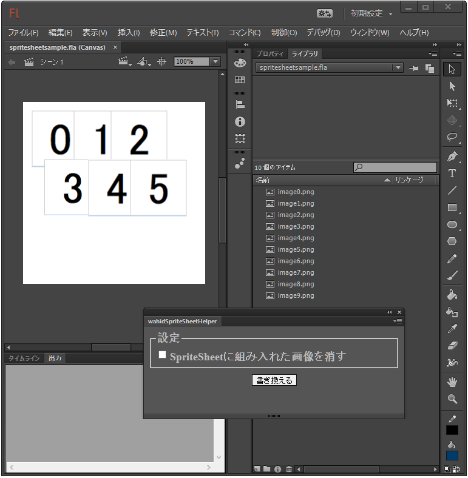
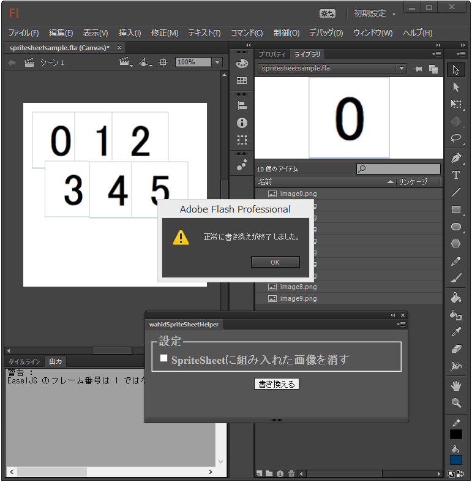

# 使い方
Extensionを使うためにあらかじめAdobe Extension Manager CCをインストールしてください。本Extension（[こちら](./exported/wahidSpriteSheetHelper.zxp)からダウンロードするか、[ソースコードからビルド](./README_ja.md#how-to-build-the-extension)してください）をダブルクリックして、無事インストールされたことをExtension Manager CC上で確認してください。

このExtensionはパブリッシュ機能で出力されたJavascriptファイルを、スプライトシート作成機能で出力されたスプライト情報で書き換えます。Javascriptが読み込む画像ファイルをスプライトシート画像に変更し、画像にsourceRect属性を設定します。またその際にスプライトシート画像に組み入れて不要となった画像を消去することもできます。

まず、通常通りバラバラな画像ファイルを組み込んだFlashドキュメントを作成します。

このFlashドキュメントをHTML5形式でパブリッシュします。この際、出力ファイルを必ず指定してください。初期値のままだと、本Extensionが出力先ディレクトリを取得できないことがあります。
  
  

バラバラな画像からスプライトシートを生成します。この際、データ形式は "JSON-ARRAY" にしてください。出力先はパブリッシュした画像ディレクトリにしてください。
  
  
  

ここで一旦Flshドキュメントを保存し、wahidSpriteSheetHelper Extensionを開きます。  
  
  

必要に応じて「SpriteSheetに組み入れた画像を消す」チェックボックスにチェックを入れて、「書き換え」ボタンを押してください。「正常に書き換えが終了しました」とメッセージが出たら完了です。パブリッシュした HTML ファイルを開いて、正常に動作することを確認してください。  
  

以上で完了です。  

# 注意事項
Flashドキュメントやパブリッシュ先ディレクトリなどのパスに空白が入っていると動作がおかしくなることがありますので、なるべく避けてください。

画像ファイルの名前には制限があります。
 * ファイル名に使える文字は英数と '_'(アンダーバー) だけです
 * ファイル名の先頭はアルファベットにしてください
 * 名前が同じで拡張子のみが異なるファイルは含めないでください
 
以上を満たした上でも、一部のファイル名はうまく扱えないことが分かっています。不具合が発生する画像ファイル名には以下のものが含まれています。
* constructor
* toString
* hasOwnedProperty
* isPrototypeOf
* などなど

以上。
